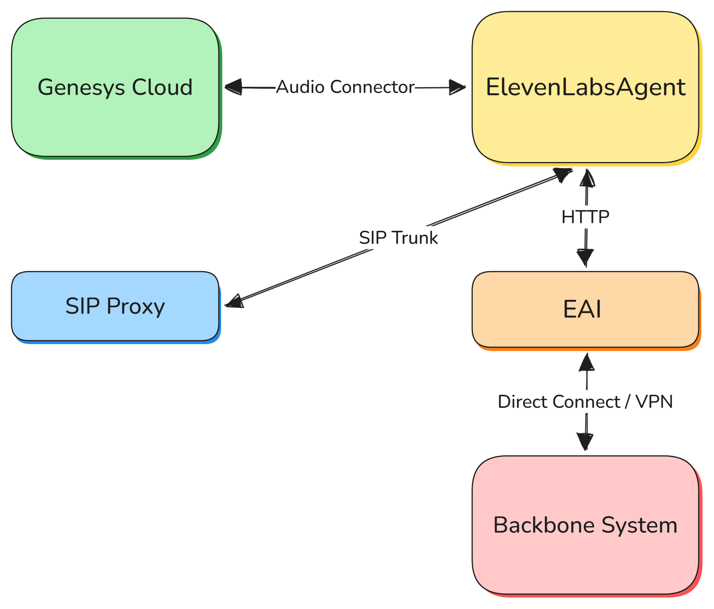

# ElevenLabs with Genesys Cloud(GC)
ElevenLabs 에서는 CCaaS 환경 구성으로 GC 를 가이드하고 있다. ([Genesys | ElevenLabs Doc](https://elevenlabs.io/docs/eleven-agents/phone-numbers/c-caa-s-integrations/genesys#overview#overview))
연동에는 별도의 개발은 필요 없고 GC 의 Audio Connector 를 통해 연동이 가능하며, GC Flow 에서 블록을 통해 호출할 수 있다. ElevenLabs 와 Audio Connector 는 `WebSocket` 을 통해 연동한다. 두 시스템은 실시간으로 양방향 오디오 스트리밍을 통해 STT 및 TTS 서비스를 제공한다. GC Flow 에서는 ElevenAgents 로 context 를 전달하기 위해 변수를 사용할 수 있으며 반대로 ElevenAgents 의 conetxt 도 변수로 전달 받을 수 있다.

## Requirements

1. Genesys Cloud CX license with bot flow capabilities
2. Administrator access to Genesys Cloud organization
3. A configured ElevenLabs account and ElevenLabs agent
4. ElevenLabs API key and Agent ID

## Agent configuration requirements

- TTS output format: Set to μ-law 8000 Hz in Agent Settings → Voice
- User input audio format: Set to μ-law 8000 Hz in Agent Settings → Advanced

## Session variables

### Input session variables

1. In Genesys flow: Define input session variables in your “Call Audio Connector” action
2. In ElevenLabs agent: Variables are available as dynamic variables and/or override configuration settings
3. Usage: Reference these variables in your agent’s conversation flow or system prompts

### Configuration overrides
기본적으로 ElevenAgents 의 "system" 으로 시작하는 변수는 업데이트할 수 없고, 아래 변수들만 가능하다.

- `system__override_system_prompt`: Overrides the agent’s system prompt.
- `system__override_first_message`: Overrides the agent’s first message to the user.
- `system__override_language`: Sets the agent’s language for this session.
- `system__override_voice_id`: Sets the agent’s voice ID for this session.

예시로 아래와 같이 ElevenAgents 의 시작 메시지를 설정 가능하다.

- `customer_name = "John Smith"`
- `system__override_first_message = "Hello! Welcome to our support line."`

### Output session variables
ElevenAgents 로 부터 받을 변수는 Data Collection 을 통해 수집한 데이터만 가능하다. 이 변수를 통하여 고객의 정보나 의도를 파악하여 GC Flow 에서 적절한 상담원으로 라우팅하도록 서비스 구현이 가능하다.

# ElevenLabs with Avaya

# ElevenAgents

## System Prompt
System Prompt 는 AI Agent 의 성격과 정책을 나타내는 청사진이다. 고객사에서는 Agnet 의 역할, 목표, 도구에 대한 지침 및 에이전트가 해서는 안될 행동을 설명하는 guardrails 등 복잡한 구조가 필요하다. 이 Prompt 를 어떻게 구성하느냐가 Agent 의 신뢰성에 직접적인 영향일 미치기 때문에 충분한 고객과의 협의와 지속적인 모니터링을 통해 유지관리가 필요하다.

### Prompt engineering fundamentals

####  명확한 섹션 경계
마크다운 제목으로 지정된 섹션을 나누면 모델에게 도움이 됩니다. 특히 모델들은 다른 제목보다 `#Guardrails`를 신경쓰도록 설계되어 있습니다.
```
# Personality

You are a customer service agent for Acme Corp. You are polite, efficient, and solution-oriented.

# Goal

Help customers resolve issues quickly by looking up orders and processing refunds when appropriate.

# Guardrails

Never share sensitive customer data across conversations.
Always verify customer identity before accessing account information.

# Tone

Keep responses concise (under 3 sentences) unless the user requests detailed explanations.
```

#### 가능한 간결하게
모든 지시는 짧고 명확해야 하며 행동 중심으로 유지한다. 간결한 지침은 모호함과 토큰을 줄여준다.
```
# Tone

Speak in a friendly, conversational manner while maintaining professionalism.
```

#### 중요한 지시 강조
중요한 단계를 강조하고 싶은경우 "이 단계는 중요하다" 를 덧붙인다. Prompt 가 복잡하면 모델이 System Prompt 보다 맥락을 우선시 할 수 있으므로, 모델이 이러한 중요한 규칙들을 간과하지 않도록 보장한다.
```
# Goal

Verify customer identity before accessing their account. This step is important.
Look up order details and provide status updates.
Process refund requests when eligible.

# Guardrails

Never access account information without verifying customer identity first. This step is important.
```

#### 텍스트 정규화
TTS 모델, 특히 빠른 모델들은 알파벳과 같이 사람이 읽을 수 있는 문자에 대한 음성 생성에 적합하게 설계되어 있다. 따라서 "@" 과 같은 기호나 숫자들은 잘못된 발음이나 음성 환각을 일으킬 가능성이 높다. 이를 해결하기 위해 정규화 전략 선택이 필요할 수 있다. ElevenAgents 는 기본적으로 System Prompt 를 따르며 Voice 설정으로 ElevenLabs 의 [TTS normalizer](https://elevenlabs.io/docs/overview/capabilities/text-to-speech/best-practices#text-normalization) 를 적용할 수 있다.

#### 가드레일 지정
모델이 반드시 지켜야하는 규칙을 `# Guardrails` 에 나열한다. 효율적인 가드레일 설계는 [Guardrails](https://elevenlabs.io/docs/eleven-agents/best-practices/guardrails)를 참고한다.

## Models
ElevenAgents 에서 지원하는 모델은 다음과 같다. 각 모델 연동을 위해서는 별도의 API Key 가 필요 없다.

| Provider       | Model                  |
| -------------- | ---------------------- |
| **ElevenLabs** | GLM-4.5-Air            |
|                | Qwen3-30B-A3B          |
|                | GPT-OSS-120B           |
| **Google**     | Gemini 3 Pro Preview   |
|                | Gemini 3 Flash Preview |
|                | Gemini 2.5 Flash       |
|                | Gemini 2.5 Flash Lite  |
|                | Gemini 2.0 Flash       |
|                | Gemini 2.0 Flash Lite  |
| **OpenAI**     | GPT-5                  |
|                | GPT-5 Mini             |
|                | GPT-5 Nano             |
|                | GPT-4.1                |
|                | GPT-4.1 Mini           |
|                | GPT-4.1 Nano           |
|                | GPT-4o                 |
|                | GPT-4o Mini            |
|                | GPT-4 Turbo            |
|                | GPT-3.5 Turbo          |
| **Anthropic**  | Claude Sonnet 4.5      |
|                | Claude Sonnet 4        |
|                | Claude Haiku 4.5       |
|                | Claude 3.7 Sonnet      |
|                | Claude 3.5 Sonnet      |
|                | Claude 3 Haiku         |

## Workflows
Workflow 는 ElevenAgents 에서 복잡한 대화 흐름을 설계할 수 있는 GUI 를 제공한다. 고객의 요구에 따라 고객사에서 동적으로 서비스할 수 있도록 ElevenAgents를 구현할 수 있다.


### Node Types

#### Subagent node
대화 흐름의 특정 시점에 Agent 동작을 수정할 수 있게 해줍니다. 각 Subagent 는 System Prompt 를 Override 하거나 자신만의 Prompt 를 정의할 수 있다. `Knowledge Base` 및 `Tools`도 별도로 지정 가능하다.

#### Say node
대화 흐름의 특정 시점에 Agent 가 고객에게 특정 음성을 안내할 수 있게 합니다. 특정 문자열을 안내할 수 도있고 Prompt 를 통해 LLM 으로 안내 가능하다.

#### Dispatch tool node
대화 흐름의 특정 시점에 도구를 실행합니다. Subagent 의 `Tools`와 달리 호출이 보장된다.

#### Agent transfer node
서로 다른 Agent 간의 대화 핸드오프를 지원합니다.

#### Transfer to number node
Agent 대화에서 전화 시스템을 통한 상담원으로 전환을 지원한다. 제한 내용은 [Transfer to number](https://elevenlabs.io/docs/eleven-agents/customization/tools/system-tools/transfer-to-number#overview) 참고한다.

#### End node
통화 종료할 때 사용한다.

### Edges and flow contro
Edge 는 Workflow 내 노드간 대화 흐름을 정의한다. Edge 는 양방향으로 정의가능하며 각각 Forward Edge, Backword Edge 라고 부른다. Forward Edges 는 다음 Node 로 이동시킨다. Backward Edges 는 이전 Node 루프될 수 있게 하여 반복적인 상호작용과 재시도 로직을 가능하게 한다.

이동 조건으로는 `LLM Condition`, `Expression`, `None` 타입을 지정할 수있다.

- **LLM Condition**: Prompt 를 통한 동적 대화 흐름을 만든다.
- **Expression**: 변수와 구조화된 데이터 기반의 조건부 논리를 통해 흐름을 만든다.
- **None**: 조건 없이 이동한다.

## Knowledge base
Agent 가 참고할 지식 기반을 설정하여 도메인 특화된 정보를 제공할 수 있다. `URL`, `Files`, `Text` 로 설정가능하다. 지식기반은 Workspace 단위로 구성 가능하고 각 Agent 에 독립적인 구성이 필요한 경우 Subagent 의 지식 기반 설정으로 가능한 것으로 보인다.

## Tools
외부 시스템과의 통합을 위한 여러 Tool 기능을 제공한다. 

- Client Tools
- Server Tools (Webhook)
- MCP Tools
- System Tools

`Client Tools`는 Web browser 나 Mobile 의 action 에 따른 assist 기능이므로 콜 시스템에서는 사용하지 않는다. 고객사 환경에서는 외부 시스템 연동이나 기간계 시스템 연동을 위해 `Server Tools`를 많이 사용할 것으로 예상된다. 단, 고객사의 기간계 서버에 직접 연동하기 위한 구성확인은 아래 ElevenLabs 참고한다.

> [!NOTE]
>
> ElevenLabs 답변
>
> * Private Deployments (독립 VPC 및 AWS 환경 구축)
> ElevenLabs는 일반적인 SaaS 환경 외에도 고객이 데이터 통제권을 완전히 확보할 수 있도록 *VPC(Virtual Private Cloud) 기반의 프라이빗 배포(Private Deployments)*를 지원합니다. 'Agents on AWS' 및 전용 VPC 인프라 구성이 제공됩니다. 따라서 전용 VPC 환경을 구성할 경우, 해당 VPC와 고객사의 내부망을 AWS Direct Connect나 PrivateLink로 연결하는 아키텍처를 구현할 수 있습니다.
> * On-Premise (설치형) 및 망분리(Air-gapped) 환경 지원
> 클라우드 전용선 연결로도 내부 보안 규정을 충족하기 어려운 고객사를 위해, 고객사의 자체 인프라 내부에 직접 설치하는 *온프레미스(On-Premise) 옵션*을 제공합니다. 이 옵션은 외부 인터넷과 완전히 차단된 폐쇄망(Air-gapped) 구성에서도 작동이 가능합니다.

### Server Tools (Webhook)
REST 기반의 인터페이스로 외부 API 를 호출할 수 있다. 구성할 때 이 도구의 Description 을 통하여 LLM이 이해하고 언제 호출해야 할지 설정할 수 있다. REST 요청의 Query Parameters 와 Body Parameters 는 모두 Dynamic Variable 로 설정가능하다. 응답도 Dynamic Variable 에 업데이트 가능하다. 

### System Tools
시스템 도구는 대화 흐름 상태를 업데이트할 수 있게 해준다. 예를 들어 통화를 종료하거나 다른 Agent 로 이전하는 등의 외부 API 연동이 아닌 내부 상태만 수정한다.

## Personalization
Dynamic Variable 기능으로 Agent 의 행동을 개인화할 수 있다.

### Dynamic Variables
Dynamic Variables 는 System Prompt 와 통합하여 개인화된 인사 메시지나 맥락을 고객 맞춤으로 설정할 수 있다. `system__` 으로 시작하는 변수들은 자동생성되며 이 예약어로 시작하는 변수 Workflow 에서 직접 생성할 수 없다. LLM 에 보내지 말아야할 개인 정보나 인증 토큰은 `secret_` 을 붙여 Secret dynamic variables 로 생성가능 하다. Dynamic variables 는 Workflow 에서 직접 업데이트할 수 없고 도구를 통해서만 가능하다.


## Monitor

### Testing
Agent 테스트는 크게 두 가지로 제공된다. 첫번째는 텍스트로 대화 맥락을 만들어 Agent 의 대화 능력을 시뮬레이션하는 Scenario Testing (LLM Evaluation) 이다. 모든 테스트 케이스를 만들어 내기는 힘들기 때문에 실제 대화 기반으로 테스트 케이스 만드는 기능도 또한 제공한다. 두번째는 Tool Call Testing 이다. 도구를 특성 상황에서 도구가 올바르게 사용되고 외부 통신까지 테스트 가능하여 개발 단계에서 많이 사용될 것으로 예상된다.

또한 대화와 도구를 통합한 Agent 자체를 시험하기 위한 Preview 기능도 제공한다. Publish 하기 전 테스트 가능하며 Voice 와 Chat 으로 테스트 가능하다. 테스트 결과는 실제 콜과 동일하게 로그로 확인 가능하다.

### Agent versioning
Agent 버전 관리는 운영환경에 직접 적용하여 발생할 수 있는 문제를 최소화 하고 다양한 구성으로 테스트할 수 있게 도와준다. 분리된 branch 를 만들고, 변경사항을 테스트하며 트레픽 배포를 통해 점진적으로 배포 가능하다.

### Conversation analysis
대화 분석은 서비스에를 평가하고 고객 상호작용에서 가치 있는 정보를 추출하여 서비스 품질을 향상시키는데 도움을 줄 수 있는 도구이다.
#### Success Evaluation
성공 평가는 대화의 질, 목표 달성, 고객 만족도를 평가항 맞춤형 지표를 설정하여 지금의 Agent 가 고객에게 얼마나 만족스러운 서비스를 제공하는게 평가하는 도구이다. 각 평가 기준은 Prompt 를 사용해 대화 내용을 분석하여 결과를 반환하다. 결과는 `success`, `failure`, `unknown` 등과 같이 정의하고 각 결과가 선택된 이유를 Prompt 로 설명하면 된다.
#### Data Collection
데이터 수집은 LLM 기반으로 대화를 분석하여 구조화된 데이터를 자동으로 추출한다. 이를 통해 수동 처리 없이도 데이터를 포착할 수 있다.

지원되는 데이터 유형은 다음과 같다.

- String: Text-based information (names, emails, addresses)
- Boolean: True/false values (agreement status, eligibility)
- Integer: Whole numbers (quantity, age, ratings)
- Number: Decimal numbers (prices, percentages, measurements)

## Review
약 2주간의 POC 를 진행하면서 초기엔 LLM 을 통한 고객 상담서비스 구현에 대해서 기능상 제약사항이나 신뢰도 문제 등으로 실현 가능성이 명확하지 않았다. 그런데, 점점 ElevenAgents 를 통해 실제 콜인프라와 연동하여 서비스를 구현해보니 LLM 을 통하여 고객 맞춤으로 동적인 서비스가 충분히 가능하겠다는 쪽으로 많이 기울었다. 기존 DTMF 나 화면 기반(보이는ARS, 디지털ARS) 에서도 처음 서비스를 개시할 때 많은 시행착오를 겪어왔던 것과 같이 LLM 을 통한 AI Agnet 도 또한 실 고객 데이터 기반으로 시나리오를 지속적으로 보완해 나간다면 사용자와 고객 모두 만족할 수 있느 서비스 구현이 가능할 것이다. 이에 따른 도구들 또한 충분이 제공하고 있고, 오히려 LLM 을 통해 흐름을 직접 구현해야할 필요가 없어 IVR 엔지니어들이 할일이 사라질 거라는 생각은 안해도 될 정도로 오히러 해야할 것이나 신경써야할 부분들이 더 많아 질 것이다. 그리고 기존 IVR 시나리오를 설계할 때 사용자에 대한 고려가 많이 되지 않았지만 고객 입력 값에 대한 범주가 넓어져 고객과 협의하는 방향 자체가 바뀔 가능성이 크다.


### 고객사 AI접목 IVR 서비스
지금까지 파악된 ElevenAgents 기능 기반으로 봤을 땐 콜 시스템으로 구현한다면 DTMF 입력이 필요하지 않은 서비스에 대해서는 충분이 현 고객사의 셀프서비스 구현이 가능하다. 현재 테스트 구성처럼 DTMF 입력을 위해 다시 GC 로 전환하여 입력받아 다시 Agent 로 돌아와 서비스 진행하면 된다. 단, 콜 서비스가 진행에 대한 context 를 별도로 저장해 놓고 Agent 서비스 시작할 때 참조할 수 있도록 별도 시스템 구성이 필요하다. 구현을 위해 필요한 구성은 다음과 같다.



- 대표번호 인입하여 ElevenAgents 로 연결할 수 있는 콜인프라 (Genesys Cloud 또는 SIP Trunk 연동을 지원하는 시스템)
- 고객사 기간계 연동을 위한 Direct Connect 구성
- 고객사 기간계 연동 데이터 변환을 위한 중계 구성
- 고객 context 저장을 위한 시스템

여러 고객사 프로젝트나 유지보수 등에서 TTS 나 STT 연동에 대하여 구성이 모두 달라서 새로 연동하는데 대응 개발이 필요하기도 하고 형상이 달라 유지보수하는데 어려움이 많은데 ElevenAgents 에서난 자체적인 연동 및 자체 TTS, STT 를 보유하고 있어 이런 관리 포인트는 적다. 

마음 AI 에서도 이렇게 콜 인프라와 SIP Trunk 연동만 되면 도입이 가능한데 신규 제안하는 고객사에 우리 음성봇에서도 이런 구성이 가능하다면 큰 도움이 될 것으로 보인다. 기존 음성봇 프로젝트에 인력이 많이 투입되고 공수가 많이 필요한 이슈도 관리가 단일화되어 있고 정리된 Admin 제공으로 해결될 것으로 예상된다.

### OAMP의 고도화 방향
이번 POC 및 다른 솔루션의 Admin 을 경험해본 내용 기반으로 검토 필요해 보이는 고도화 방향은 다음과 같다. 주된 방향은 서버 콘솔 접속 최소화 하며 OAMP 를 통한 통합 Admin 이다. 단, OAMP 만 고도화 하는 방향으로 검토하다보면 IVR 엔진 자체의 기능적 제약사항으로 완성도 있는 결과가 나오지 않는 것은 감안해야할 것이다.

#### 시나리오디자이너 & OAMP 통합
10년 전부터 언급되었고 3년 전에 시도는 되었으나 마무리가 되지 않았다. 여러 고객사에서 불만이 나오고 있는 상황이라 적극적인 검토가 필요하다. 로드맵의 시나리오디자이너 화면 통합이 있는데 이것과 연관이 있는 지 확인이 필요하다.

#### 시나리오 버전관리 기능 강화
ElevenAgents 의 버전관리의 트래픽 분산 기능은 좋은 아이디어 인 것 같다. 단, IVR 엔진 수정이 불가피하다.

#### 로그 분석 기능 고도화
지금은 IVR 엔진에서 기록하는 로그나 이벤트 로그 정도만 확인이 가능한데, ElevenAgents 의 Conversation history 와 같이 검색 조건 도 좀더 상세화 하고 흐름에 따라 현 시점의 Session Context (Dynamic Variable, 외부 연동 성공/실패 여부 및 IN/OUT) 도 확인 가능하면 더 좋을 것 같다.

#### OAMP 을 통한 시스템 Configuration (SIP, STT, TTS, CTI ...)
올해 Marsys 과제에도 있는 인데, 시스템 설정을 콘솔 접속 없이 OAMP 에서 가능하개 하는 인터페이스 제공하는 것이다. SaaS 기반 애플리케이션에서는 필수로 제공되어야 하는 기능이기도 하고 서버마다의 형상을 OAMP 를 통해 관리할 수 있어 운영 측면에 큰 도움이 될 것이다.

#### OAMP 을 통한 시나리오 및 외부 API 연동 자체 테스트 기능
음성봇에서도 있는 기능인데, OAMP 에서도 제공된다면 구축 및 운영에 큰 도움이 될 것 같다. 시나리오 테스트는 음성봇이나 ElevenLabs 의 Preiview 기능 참고하면 될 것 같다. 
